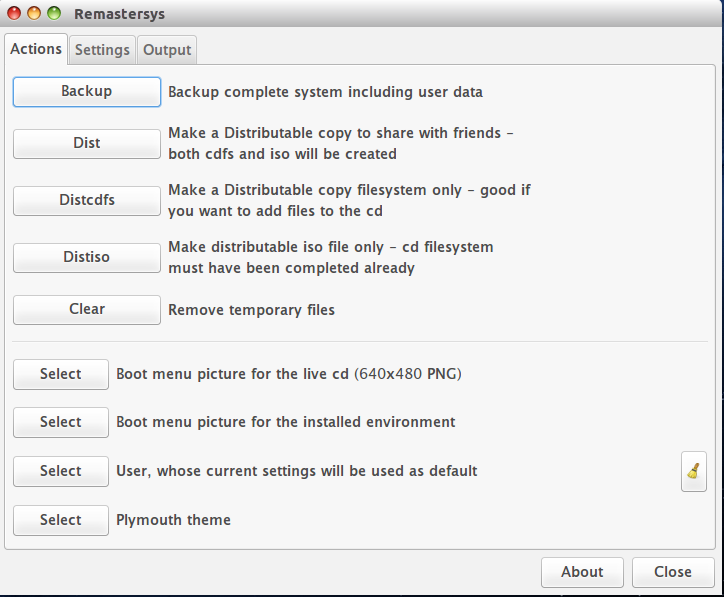
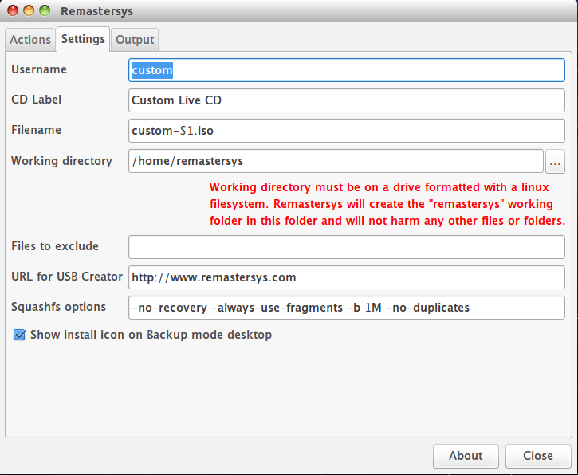
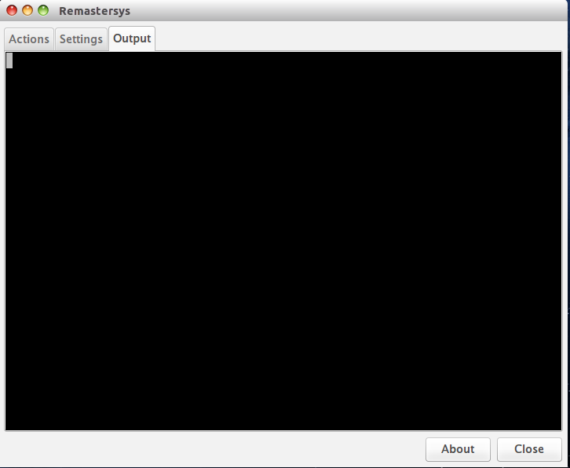

remastersys
===========

Remastersys Tool for Backup Your Ubuntu System

Fork from [http://www.remastersys.com] "no longer active". All credit goes to Mutse Young and Tony BrijeskiBreyta

## How to install

Ubuntu 14.04:

    sudo add-apt-repository ppa:enperry24/remastersys
    sudo apt-get update
    sudo apt-get install remastersys remastersys-gtk

## Screenshot

### Actions

### Settings

### Output

